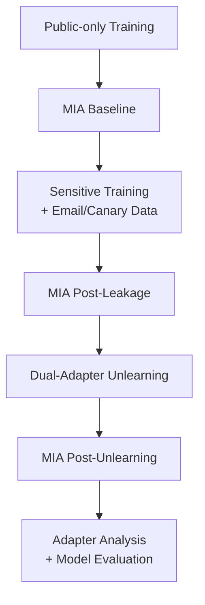

# 🔐 LeakCheck: Dual-Adapter Unlearning for Privacy-Preserving Large Language Models in Federated Settings

> **A privacy auditing and machine unlearning framework for detecting and mitigating sensitive-data memorization in federated Large Language Models (LLMs).**

[](https://www.python.org/)
[](https://pytorch.org/)
[](https://huggingface.co/)
[](https://flower.ai/)
[](https://huggingface.co/docs/peft)

---

## Overview

**LeakCheck** investigates privacy leakage in Large Language Models trained in **federated learning environments**.

Federated Learning allows multiple clients to collaboratively train a model without directly sharing their local training data. However, sensitive information can still be **memorized by the model**, potentially making it recoverable through attacks such as **Membership Inference Attacks (MIA)**.

LeakCheck addresses this problem through a pipeline that:

1. Creates federated client datasets containing public and sensitive information.
2. Fine-tunes a language model using LoRA (Low-Rank Adaptation).
3. Simulates federated training using Flower.
4. Introduces synthetic sensitive information and unique canary tokens to evaluate memorization.
5. Measures privacy leakage using loss-based Membership Inference Attacks.
6. Applies dual-adapter machine unlearning to remove sensitive information.
7. Preserves non-sensitive knowledge using a separate retain adapter.
8. Evaluates the effect of unlearning on model behavior and adapter parameters.
9. Aggregates client-side adapters into a final global LoRA model.

---

## Problem Statement

Traditional federated learning protects raw data from being directly exchanged between clients, but it does **not guarantee that sensitive information will not be memorized by the global model**.

For example, a client may locally train on data containing:

Contact: alice123@example.com. This is sensitive; do not expose.

or a unique canary such as:

CANARY_SECRET_001_X7F2A91B

If the model memorizes these identifiers, an attacker may be able to distinguish training samples from non-training samples.

Therefore, the project investigates:

> **Can sensitive information memorized during federated LLM training be identified and subsequently removed while preserving useful model knowledge?**

---

# 🧠 Proposed Approach

LeakCheck combines several techniques into a single privacy pipeline:

                    ┌─────────────────────┐
                    │   Public Dataset    │
                    │     WikiText-2      │
                    └──────────┬──────────┘
                               │
                               ▼
                    ┌─────────────────────┐
                    │ Federated Clients   │
                    │      Client 1       │
                    │      Client 2       │
                    │      Client 3       │
                    └──────────┬──────────┘
                               │
                    Sensitive Data Injection
                               │
             ┌─────────────────┴─────────────────┐
             │                                   │
             ▼                                   ▼
     Synthetic Emails                     Canary Tokens
             │                                   │
             └─────────────────┬─────────────────┘
                               ▼
                    ┌─────────────────────┐
                    │   LoRA Fine-Tuning  │
                    │  GPT-Neo-125M       │
                    └──────────┬──────────┘
                               │
                               ▼
                    ┌─────────────────────┐
                    │ Privacy Evaluation  │
                    │        MIA          │
                    └──────────┬──────────┘
                               │
                               ▼
                    ┌─────────────────────┐
                    │ Dual-Adapter        │
                    │ Unlearning          │
                    └──────────┬──────────┘
                               │
                 ┌─────────────┴─────────────┐
                 ▼                           ▼
          Forget Adapter               Retain Adapter
          Sensitive Data               Useful Knowledge
                 │                           │
                 └─────────────┬─────────────┘
                               ▼
                    ┌─────────────────────┐
                    │ Post-Unlearning     │
                    │ Privacy Evaluation  │
                    └──────────┬──────────┘
                               │
                               ▼
                    ┌─────────────────────┐
                    │ Global LoRA Model   │
                    └─────────────────────┘

# System Architecture

LeakCheck consists of four major stages.

### 1. Federated Data Preparation

The system creates multiple simulated clients.

Each client receives:

* Public WikiText-2 samples
* Sensitive information
* Synthetic email addresses
* Unique canary tokens

The project uses **3 federated clients**.

Sensitive information is intentionally introduced to create a controlled environment for evaluating privacy leakage.

### 2. Parameter-Efficient Fine-Tuning

Instead of modifying the entire language model, LeakCheck uses **LoRA**.

The base model is:
EleutherAI/gpt-neo-125M
The base model parameters remain frozen while LoRA parameters are optimized.

The LoRA configuration uses:

Rank (r):        16
LoRA Alpha:      64
Dropout:         0.05
Target modules:  q_proj, v_proj

This significantly reduces the number of parameters that need to be trained and makes adapter-level analysis and manipulation practical.

# 🔀 Dual-Adapter Architecture

A central component of LeakCheck is the use of two separate LoRA adapters:

                    Base GPT-Neo
                         │
             ┌───────────┴───────────┐
             │                       │
             ▼                       ▼
      Forget Adapter          Retain Adapter
             │                       │
      Sensitive Data            Redacted /
        Unlearning              Safe Data
             │                       │
             └───────────┬───────────┘
                         ▼
                  Updated Adapters

### Forget Adapter

The forget adapter is optimized using sensitive training examples.

During unlearning, its gradient contribution is reversed/scaled to encourage the model to move away from the sensitive information.

### Retain Adapter

The retain adapter is trained using retained information after sensitive entities are redacted.

This provides a preservation signal intended to reduce unnecessary degradation of useful knowledge.

# Sensitive Information Detection

LeakCheck identifies potentially sensitive information through multiple mechanisms.

### Regular Expressions

The system detects:

* Email addresses
* Phone numbers
* Canary tokens

Example:
python
emails = re.findall(
    r'\b[\w\.-]+@[\w\.-]+\.\w+\b',
    text
)


### Named Entity Recognition

A Hugging Face NER pipeline is also used to identify person names.

Only selected high-confidence entity types are treated as sensitive.

Detected entities can then be replaced with:

[REDACTED]

before being used as retain data.

# 🧪 Privacy Auditing with Membership Inference Attacks

LeakCheck uses a loss-threshold Membership Inference Attack to investigate whether a sample appears to have been part of the model's training data.

For each sample, the model's language-model loss is calculated.

The attack uses a threshold based on the average member and non-member losses:

threshold =
    (mean member loss + mean non-member loss) / 2

A sample is predicted as a member when:

loss < threshold

The evaluation records:

* MIA accuracy
* True Positives
* False Positives
* False Negatives
* True Negatives
* Mean member loss
* Mean non-member loss

This allows the privacy leakage to be evaluated at different stages of the pipeline.
# Evaluation Pipeline

# 🧹 Dual-Target Unlearning

The unlearning process computes separate gradients for:

### Forget objective

The model calculates gradients using sensitive samples.

The forget gradient is given a negative scaling factor:

-alpha × forget_gradient

### Retain objective

The model calculates gradients on redacted retain data:

```text
+ beta × retain_gradient
```

The gradients are then combined:

```text
combined_gradient =
    (-alpha × forget_gradient)
    +
    (beta × retain_gradient)
```

This creates a targeted optimization process that simultaneously encourages forgetting sensitive information while maintaining useful knowledge.

---

# 🛡️ Gradient Clipping & Differential Privacy Support

The implementation also includes support for:

* Gradient norm clipping
* Optional Gaussian noise
* Configurable DP noise multiplier

The parameters include:

```text
dp_clip
dp_noise_multiplier
```

The current experimental configuration can disable noise when debugging or evaluating the underlying unlearning behavior.

> **Note:** The implementation's optional DP mechanism should not be interpreted as a formally proven differential privacy guarantee. A formal DP claim would require a complete privacy accounting and calibrated mechanism.

---

# 📊 Model Evaluation

LeakCheck evaluates the model before and after unlearning using:

### Loss

Language-model evaluation loss is measured on:

* Forget set
* Retain set
* Combined set

### Perplexity

Perplexity is calculated as:

```text
Perplexity = exp(loss)
```

### Privacy

MIA performance is measured before and after unlearning.

### Adapter-level Analysis

The project also compares LoRA adapter parameters before and after unlearning.

Metrics include:

* Adapter norm before unlearning
* Adapter norm after unlearning
* Cosine similarity
* Top-k parameter drifts

This provides a parameter-level view of how the unlearning procedure changes the model.

---

# 🌐 Federated Learning

The project integrates **Flower** to simulate federated training.

The current implementation uses:

```text
Number of clients: 3
Aggregation:       FedAvg
Federated rounds:  2
```

Client-side LoRA parameters are exchanged instead of the full base model.

Conceptually:

```text
             Server
                │
        ┌───────┼───────┐
        ▼       ▼       ▼
     Client 1 Client 2 Client 3
        │       │       │
        ▼       ▼       ▼
      LoRA    LoRA     LoRA
        │       │       │
        └───────┼───────┘
                ▼
             FedAvg
                │
                ▼
        Global LoRA Model
```

---

# 🧰 Technologies

### Machine Learning / AI

* Python
* PyTorch
* Hugging Face Transformers
* Hugging Face Datasets
* PEFT
* LoRA

### Federated Learning

* Flower (`flwr`)

### Privacy / Security

* Membership Inference Attacks
* Machine Unlearning
* Sensitive-data detection
* Data redaction
* Canary-based memorization testing
* Optional gradient noise and clipping

### Data Processing

* NumPy
* Pandas
* Regular Expressions

### Model

```text
EleutherAI/gpt-neo-125M
```

### Dataset

```text
WikiText-2
```

---

# 📁 Project Structure

A typical execution produces the following structure:

```text
LeakCheck/
│
├── client_data/
│   ├── client0_split.pt
│   ├── client1_split.pt
│   └── client2_split.pt
│
├── checkpoints/
│   ├── client0_lora_last.pth
│   ├── client1_lora_last.pth
│   ├── client2_lora_last.pth
│   ├── client0_lora_unlearn_*.pth
│   ├── client1_lora_unlearn_*.pth
│   └── client2_lora_unlearn_*.pth
│
├── final_global_model_2/
│
├── federated_lora_dual_unlearning.py
│
├── Federated_Unlearning_simple.ipynb
│
└── README.md
```

---

# 🚀 Installation

Clone the repository:

```bash
git clone https://github.com/YOUR_USERNAME/YOUR_REPOSITORY.git
cd YOUR_REPOSITORY
```

Install the main dependencies:

```bash
pip install torch
pip install transformers
pip install datasets
pip install peft
pip install "flwr[simulation]"
pip install pandas
pip install numpy
```

---

# ▶️ Running the Project

Run the main Python implementation:

```bash
python federated_lora_dual_unlearning.py
```

Or run the notebook:

```text
Federated_Unlearning_simple.ipynb
```

The first execution downloads the required model and WikiText-2 dataset from Hugging Face.

A CUDA-compatible GPU is recommended for practical execution.

---

# 📈 Experimental Design

The experiment intentionally creates a controlled privacy-leakage scenario.

### Public Phase

Clients train using public WikiText-2 data.

A baseline MIA is performed.

### Sensitive Phase

Sensitive information is introduced into client datasets.

Examples include:

```text
Synthetic email addresses
Unique canary identifiers
Sensitive contextual text
```

The model is then trained on the contaminated data.

### Attack Phase

MIA is performed against previously seen sensitive samples and held-out non-member samples.

### Unlearning Phase

The dual-adapter optimization is applied to the sensitive data.

### Post-Unlearning Phase

The same sensitive samples are evaluated again to determine whether their membership signal changes.

The retain set is also evaluated to investigate potential utility degradation.

---

# 🔐 Privacy Threat Model

LeakCheck focuses on a scenario where:

1. Clients possess local data.
2. Some local data contains sensitive information.
3. The language model is trained on this data.
4. The model may memorize sensitive information.
5. An attacker can query or evaluate the model.
6. The attacker attempts to infer whether a particular sample was part of training.

The project therefore investigates **model-level privacy leakage**, rather than relying solely on protection of the raw federated data.

---

# 💡 Why This Project Matters

Federated learning reduces the need to centrally collect sensitive user data, but **data privacy does not automatically end when training data stays on the client**.

A model can still retain information learned from local datasets.

LeakCheck explores a complementary privacy strategy:

> **Detect → Measure → Forget → Verify**

```text
Sensitive Data
      ↓
Detection
      ↓
Model Training
      ↓
Privacy Audit
      ↓
MIA
      ↓
Unlearning
      ↓
Post-Unlearning Audit
      ↓
Verify Privacy Improvement
```

---

# 👩‍💻 My Contribution

This project involved the design and implementation of a privacy-preserving federated LLM experimentation pipeline.

Key contributions include:

* Designing the federated unlearning workflow.
* Implementing LoRA-based parameter-efficient fine-tuning.
* Implementing separate forget and retain adapters.
* Developing sensitive-data detection and redaction mechanisms.
* Generating synthetic sensitive data and canary tokens.
* Implementing a loss-based Membership Inference Attack.
* Developing the dual-target gradient-based unlearning mechanism.
* Implementing gradient clipping and optional noise injection.
* Evaluating model loss and perplexity before and after unlearning.
* Implementing adapter-level parameter drift analysis.
* Integrating federated simulation using Flower.
* Aggregating client LoRA adapters into a global model.

---

# ⚠️ Limitations

This project is an experimental research prototype and has several limitations.

* The experiments use a relatively small language model (`GPT-Neo-125M`).
* Federated training is simulated rather than deployed across real independent devices.
* The current experiments use a small number of clients.
* The MIA uses a relatively simple loss-threshold attack.
* Synthetic sensitive data is used for controlled experiments.
* The optional gradient noise mechanism does not by itself establish a formal differential privacy guarantee.
* The unlearning approach requires further evaluation against stronger privacy attacks and alternative unlearning baselines.
* More extensive experiments are needed to establish generalization to larger LLMs and realistic federated environments.

---

# 🚧 Future Work

Potential extensions include:

* Testing larger LLM architectures.
* Increasing the number of federated clients.
* Evaluating non-IID client distributions.
* Implementing stronger Membership Inference Attacks.
* Evaluating prompt-based extraction attacks.
* Measuring canary exposure directly.
* Comparing against additional machine-unlearning methods.
* Adding formal differential privacy accounting.
* Evaluating communication efficiency.
* Measuring downstream utility preservation.
* Testing adversarial clients.
* Evaluating robustness against repeated model queries.
* Deploying federated clients across distributed environments.

---

# 📚 Research Areas

LeakCheck combines research concepts from:

* Federated Learning
* Large Language Models
* Privacy-Preserving Machine Learning
* Machine Unlearning
* Membership Inference Attacks
* Parameter-Efficient Fine-Tuning
* Differential Privacy
* Cybersecurity
* Data Privacy

---

# 📄 Research Context

This project was developed as a research-oriented Bachelor’s graduation project exploring privacy risks in federated Large Language Models and targeted removal of sensitive information.

**Project:**
**LeakCheck: Dual-Adapter Unlearning for Privacy-Preserving Large Language Models in Federated Settings**

---

## ⭐ Key Takeaway

LeakCheck demonstrates an experimental approach to **privacy auditing and targeted machine unlearning in federated LLMs**, combining:

```text
Federated Learning
        +
LoRA
        +
Privacy Auditing
        +
Membership Inference Attacks
        +
Dual-Adapter Unlearning
        +
Sensitive Data Redaction
        +
Adapter-Level Analysis
```

The goal is not simply to train an LLM, but to investigate **what happens when sensitive information is learned, how that leakage can be measured, and whether targeted unlearning can reduce the resulting privacy risk.**

---

## 👩‍💻 Author

**Miriam Ibrahim**

Computer Science — Cybersecurity

German International University (GIU)

[GitHub](https://github.com/miriamibrahim) · [LinkedIn](YOUR_LINKEDIN_URL)
